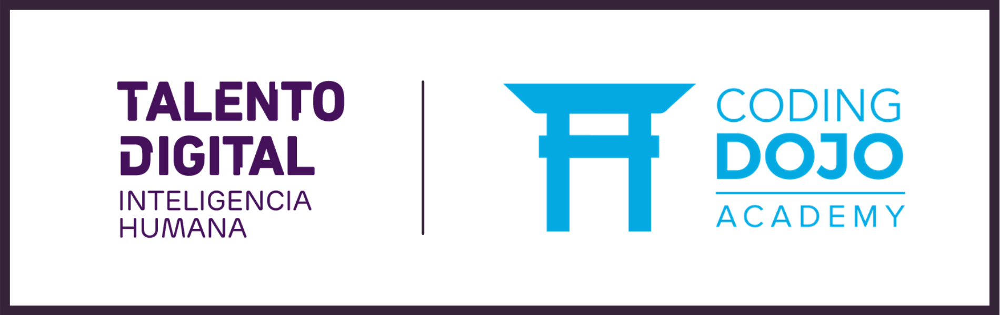

# Desarrollo de Aplicaciones Full Stack Python Trainee 👨‍💻

**Total de Horas: 428**

>Programa diseñado para desarrollar las habilidades necesarias para construir y mantener piezas de software en lenguaje Python y frameworks basados en Python, crear aplicaciones web en full stack Python y operar una base de datos para almacenar y manipular datos, a partir de especificaciones técnicas dadas que den solución a las problemáticas de la organización, aplicando buenas prácticas de programación con el objeto de lograr un producto con niveles de calidad acordes a las necesidades de la industria.

## Módulos
- Fundamentos del desarrollo web
- Programación básica en Python
- Programación Avanzada en Python
- Lenguaje de consultas a una base de datos
- Desarrollo de aplicaciones web con Python/Django
- Acceso a bases de datos con Python/Django
- Control de seguridad de acceso con Django
- Apresto laboral
